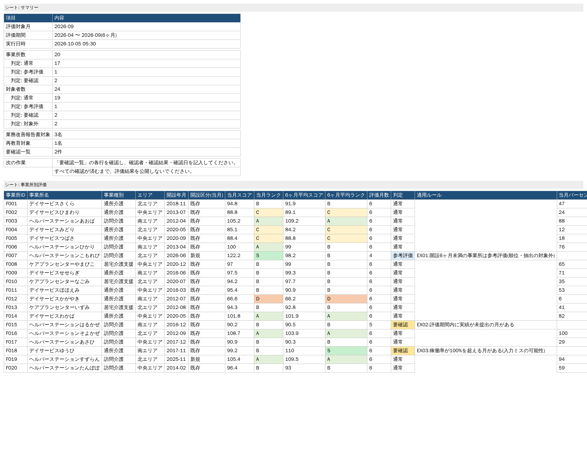
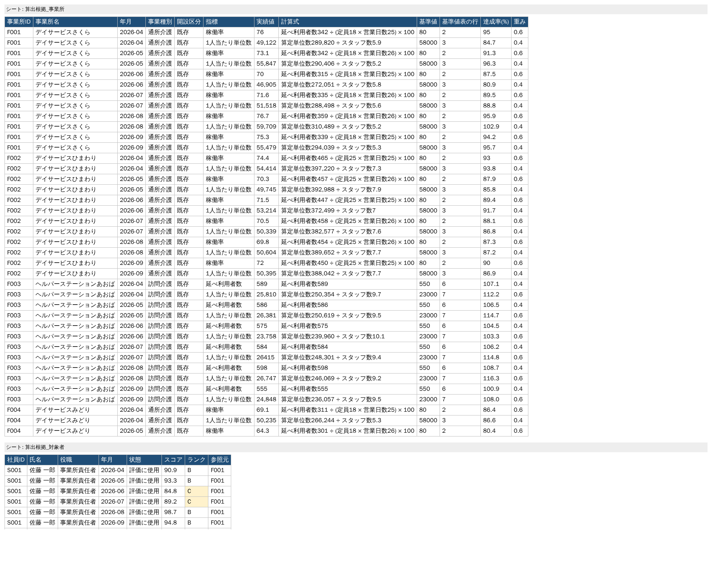
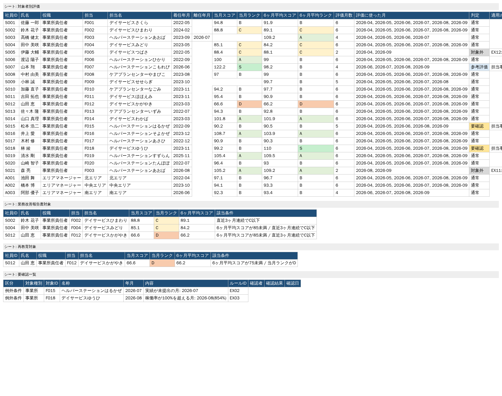
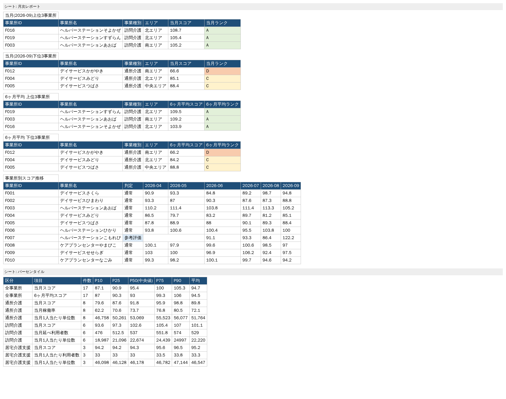

# 事業所評価 自動算出ツール(デモ)

複数事業所の月次実績データを集計し、事業種別や開設時期ごとの基準値と照合して評価を算出するツールのデモです。
例外処理、対象者の抽出、月次レポートの作成まで自動で行います。

> データはすべて架空のものです。実在の事業所・人物とは関係ありません。



## できること

| 処理 | 内容 |
|---|---|
| ① 実績データの取り込み・整形 | 事業所マスタ、月次実績、着任情報、休職情報(CSV)を読み込み、入力の不備をチェックする |
| ② 対象判定 | 事業種別×開設区分(新規/既存)から、事業所ごとに適用する基準値を決める |
| ③ 評価算出 | 指標ごとの達成率を重み付きで合算してスコアを出し、ランク(S〜D)を付ける |
| ④ 例外判定 | 開設直後、実績の欠損、入力ミスの疑い、着任直後、休職などを判定し、「参考評価」「要確認」「対象外」に振り分ける |
| ⑤ 対象者の抽出 | 業務改善報告書の対象者、再教育の対象者を抽出条件に従って抽出する |
| ⑥ レポート作成 | 当月・6ヶ月平均の上位/下位3事業所、スコア推移、パーセンタイルをExcelにまとめる |

## 設計方針

**1. ルールは担当者が Excel で編集できる**

基準値、ランクの境目、例外条件、抽出条件はすべて [`rules/評価ルール.xlsx`](rules/評価ルール.xlsx) で管理しています。
プログラムを直さなくても、閾値の変更、ルールの追加・無効化ができます。
選択式の列にはプルダウンを設定しているので、書き間違いが起きにくくなっています。
もし書き間違いがあっても「基準値シートの3行目の指標が不正」のように、場所を示して処理を止めます。

| シート | 内容 |
|---|---|
| 設定 | 評価期間(6ヶ月)、新規と判定する開設後の月数、達成率の上限 |
| 基準値 | 事業種別×開設区分×指標ごとの基準値と重み |
| 評価ランク | スコアとランク(S/A/B/C/D)の対応 |
| 例外条件 | 条件・閾値・処理(対象外/要確認/参考評価)。「有効」を×にすると無効化できる |
| 抽出条件 | 業務改善報告書対象・再教育対象などの抽出条件。同じ区分内はどれか1つに当てはまれば抽出 |

**2. すべての評価に算出根拠を残す**

賞与査定や昇降格に使うことを想定し、「なぜこの評価になったか」を後から追えるようにしています。

- **算出根拠_事業所**: 事業所×月×指標ごとに、実績値・計算式・適用した基準値・基準値表の行番号・達成率・重み
- **算出根拠_対象者**: 対象者×月ごとに、評価に使った月か(休職・着任前・離任後など)、参照した事業所
- **実行ログ**: 入力ファイルと評価ルールのハッシュ値、適用した設定(同じファイルで再実行すれば同じ結果になることを確認できる)



**3. 計算に AI の判断を使わない**

評価の公平性と再現性を保つため、計算はすべてルールどおりに処理するプログラムで行います。
同じ入力とルールからは必ず同じ結果になります(テストで確認しています)。

**4. 最終判断は人が行う**

自動で判定できないものは「要確認一覧」に回し、確認者・確認結果・確認日を記入する欄を設けています。
要確認になった対象者が抽出条件に当てはまる場合は、自動では抽出せず「抽出保留」として一覧に載せます。



## 出力されるExcel

`output/評価結果_YYYY-MM.xlsx`(サンプル: [`output/評価結果_2026-09.xlsx`](output/評価結果_2026-09.xlsx))

| シート | 内容 |
|---|---|
| サマリー | 件数の集計と、次にやること |
| 事業所別評価 | 当月・6ヶ月平均のスコアとランク、判定、適用ルール、順位、パーセンタイル順位 |
| 対象者別評価 | 事業所責任者・エリアマネージャーごとの評価、評価に使った月、判定 |
| 業務改善報告書対象 / 再教育対象 | 抽出された対象者と、該当した条件 |
| 要確認一覧 | 人の確認が必要な項目と承認欄 |
| 月次レポート | 上位/下位3事業所(当月・6ヶ月平均)、事業所別スコア推移 |
| パーセンタイル | 全体・事業種別ごとのスコアと各指標の P10〜P90 |
| 算出根拠_事業所 / 算出根拠_対象者 / 実行ログ | 上記「算出根拠」を参照 |



## 評価ロジック

**事業所のスコア**

```
達成率(%) = 実績値 ÷ 基準値 × 100   (上限150%で打ち切り)
スコア    = Σ(達成率 × 重み) ÷ Σ重み
```

| 指標 | 計算式 |
|---|---|
| 稼働率 | 延べ利用者数 ÷ (定員 × 営業日数) × 100 |
| 1人当たり単位数 | 算定単位数 ÷ スタッフ数(常勤換算) |
| 1人当たり利用者数 | 延べ利用者数 ÷ スタッフ数 |
| 延べ利用者数 / 算定単位数 | 実績値そのまま |

開設から12ヶ月未満の月は「新規」の基準値、それ以降は「既存」の基準値を使います。

**対象者のスコア**

- 事業所責任者: 担当事業所の月次スコア。着任前・離任後・休職中の月は除いて平均を取る
- エリアマネージャー: 担当エリア内の「通常」判定の事業所の平均スコア
- 事業所責任者は、担当事業所の判定(参考評価・要確認)を引き継ぐ

**判定の優先順位**

複数の例外に当てはまった場合は、強いほうを採用します: 対象外 > 要確認 > 参考評価 > 通常。
順位・パーセンタイル順位・抽出は「通常」判定のものだけで行います。

## サンプルデータに仕込んだケース

| 対象 | 状況 | 結果 |
|---|---|---|
| F004 / S004 | 実績がやや低迷 | 業務改善報告書対象 |
| F012 / S012 | 実績が大きく低迷 | 業務改善報告書対象・再教育対象 |
| F007 | 開設4ヶ月 | 参考評価(順位・抽出の対象外) |
| F015 | 7月の実績が未提出 | 要確認 |
| F018 | 8月の延べ利用者数が桁違い(稼働率854%) | 要確認 |
| F019 | 開設1年未満 | 新規の基準値で評価 |
| S003 → S021 | 7月末に責任者が交代 | S003は4ヶ月分で評価、S021は着任2ヶ月で対象外 |
| S005 | 4ヶ月休職 | 対象外 |
| S009 | 当月のみ休職 | 残り5ヶ月で評価 |
| A003 | 期中に着任 | 着任後の4ヶ月で評価 |

## 使い方

```bash
pip install -r requirements.txt

python generate_sample_data.py           # サンプルデータとルール表を作る(初回のみ)
python run_evaluation.py --month 2026-09 # 評価を実行
python -m pytest                         # テスト
```

Windows では `実行.bat` をダブルクリックし、評価対象月を入力するだけで実行できます。

入力CSVは UTF-8 と Shift-JIS のどちらでも読み込めます。別のフォルダやルール表を使う場合は次のように指定します。

```bash
python run_evaluation.py --month 2026-09 --data data/2026-09 --rules rules/評価ルール.xlsx --out output
```

## 構成

```
├── run_evaluation.py        実行の入口
├── generate_sample_data.py  架空データとルール表の生成
├── evaluator/
│   ├── loader.py            CSVの読み込み・入力チェック
│   ├── rules.py             ルール表の読み込み・書き間違いチェック
│   ├── engine.py            評価算出・例外判定・抽出
│   └── report.py            Excel出力
├── rules/評価ルール.xlsx      担当者が編集するルール表
├── data/sample/             サンプル入力データ
├── output/                  出力先
└── tests/                   テスト
```

## 実案件で拡張する場合

- 社内システムの出力形式に合わせて、`evaluator/loader.py` の列の対応を変える
- 新しい種類の指標・例外条件を追加する場合は、`engine.py` に計算処理を1つ追加し、ルール表で使えるようにする
- 業務改善報告書の内容チェックやフィードバック文の下書きなど、文章を扱う処理には AI(LLM)を組み合わせられる
  (評価の数値計算とは切り離して、人の確認を前提にする)
